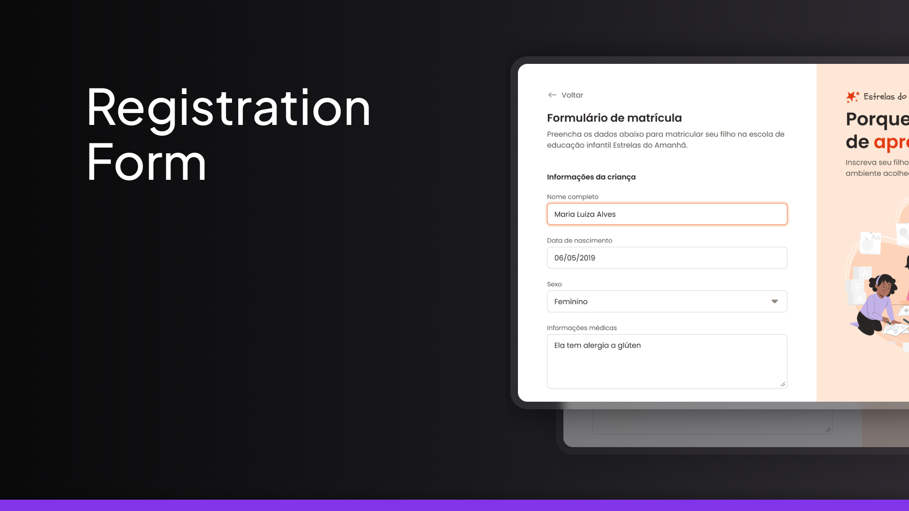

<h1 align="center"> Registration form </h1>

School registration form.  

  <a href="#-tecnologias">Technologies</a>&nbsp;&nbsp;&nbsp;|&nbsp;&nbsp;&nbsp;
  <a href="#-Project">Project</a>&nbsp;&nbsp;&nbsp;|&nbsp;&nbsp;&nbsp;
  <a href="#-layout">Layout</a>&nbsp;&nbsp;&nbsp;

 

  

## 🚀 Technologies

This project was developed with the following technologies:

- HTML e CSS
- Git e Github
- Figma

## 💻 Project

School registration form.

- [Access the finished project online](https://gusfornari.github.io/Registration-Form/)

## 🔖 Layout

You can view the project layout through [This link](hhttps://www.figma.com/community/file/1365016793556649696/formulario-de-matricula). You must have a [Figma](https://figma.com) account to access it.

---

Made with ♥ by Leschiutta :wave:
